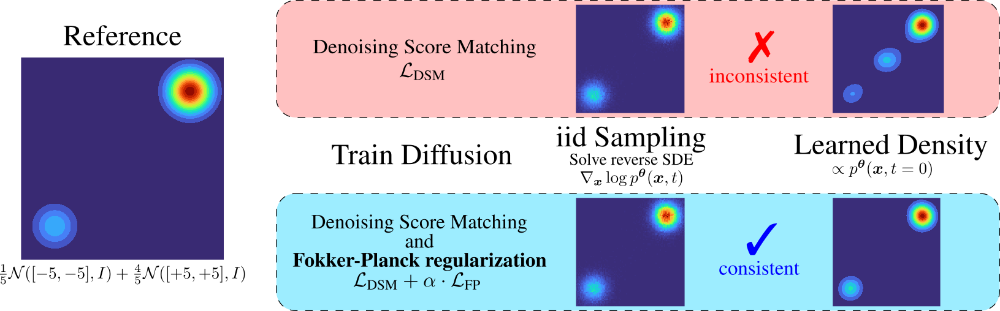

<h1 align="center">Consistent Sampling and Simulation: Molecular Dynamics with Energy-Based Diffusion Models</h1>
<p align="center">
<a href="https://arxiv.org/abs/2506.17139"></a>
<a href="https://colab.research.google.com/drive/1r3DGOpGZgIbx7p_uWbsm0b6iP-kiyU_v"></a>
<a href="https://colab.research.google.com/drive/1rbcNDwDduPw5QMulbOC-Pg6xGd4wGjej"></a>
</p>

<p align="center">
  
</p>

<p align="center">
  <em>Animation showing the two modes of our model: independent sampling by diffusion denoising (left) and molecular dynamics simulation (right).</em>
</p>

## Overview

This repository contains the complete codebase for training and evaluating energy-based diffusion models for molecular dynamics simulations. Our approach enables a single model to perform both independent sampling via diffusion denoising and continuous molecular dynamics simulations through a Fokker-Planck-based regularization scheme.

## Method

<p align="center">

</p>

<p align="center">
  <em>We introduce a Fokker-Planck-based regularization to train an energy-based diffusion model with stable, self-consistent scores near the data distribution. This regularization ensures that the learned score function corresponds to a consistent energy function, enabling the model to perform both generative sampling and accurate energy-estimation.</em>
</p>

## Tutorial

We provide minimal working implementations in Jupyter notebooks:
- **[JAX version](https://colab.research.google.com/drive/1r3DGOpGZgIbx7p_uWbsm0b6iP-kiyU_v)** (recommended) - Faster and closer to this repository's implementation
- **[PyTorch version](https://colab.research.google.com/drive/1rbcNDwDduPw5QMulbOC-Pg6xGd4wGjej)** - Alternative implementation

Both notebooks demonstrate how to reproduce similar figures to the one shown above and perform molecular dynamics simulations with a diffusion model on the Müller-Brown potential. 

# 🚀 Getting Started

## Installation

All dependencies are managed with [pixi](https://github.com/prefix-dev/pixi), which ensures fully reproducible environments across different systems.

To set up the environment, run:

```bash
pixi install --frozen
```


To activate the environment, run:
```bash
pixi shell
```

### Alternative Installation Methods

If you prefer using your own dependency manager (e.g., conda, pip), you can install the dependencies listed in `pyproject.toml` with your preferred tool.


## Quick Start: Toy Systems

We use [Hydra](https://hydra.cc/) for configuration management. You can override any configuration via command-line arguments or configuration files.

Train on example toy systems using the provided configurations:

```bash
python train.py dataset=double_well +architecture=mlp/small_potential
python train.py dataset=double_well_2d +architecture=mlp/small_potential
```

Outputs will be saved to the `outputs/` directory.

# 🧬 Working with Molecules
> [!IMPORTANT]
> This repository does **not** contain all datasets directly.
> Training data for the toy systems and alanine dipeptide will be downloaded automatically. 
> For the dipeptides, you can download the dataset from [this release](https://github.com/noegroup/ScoreMD/releases/tag/1.0.0) and place it into the `./storage` directory (one subfolder for each dataset, e.g. `./storage/minipeptides/`, `./storage/deshaw/`).
> Data for the fast-folder systems can be requested from D. E. Shaw Research, as described in the [original paper](https://www.science.org/doi/full/10.1126/science.1208351).
> If you do not have access to the fast-folder data, [this release](https://github.com/noegroup/ScoreMD/releases/tag/1.0.0) also provides dummy data generated by our models, which is sufficient for inference.

## Running Inference with Pre-Trained Models

We provide pre-trained model weights for all models presented in the paper. For detailed instructions on downloading and using these models, please refer to [INFERENCE.md](INFERENCE.md).

## Training Models from the Paper

To reproduce the results from our paper, see [TRAIN.md](TRAIN.md) for the exact training commands used for each model and dataset. 

## Evaluation and Plotting Scripts

For implementation details and benchmarking against your own methods, we provide evaluation scripts in the [evaluation](evaluation/README.md) directory.

# Contributing

Feel free to open an issue if you encounter any problems or have questions.

# Citation

If you find our work useful, please cite:

```
@article{plainer2025consistent,
  author = {Plainer, Michael and Wu, Hao and Klein, Leon and G{\"u}nnemann, Stephan and No{\'e}, Frank},
  title = {Consistent Sampling and Simulation: Molecular Dynamics with Energy-Based Diffusion Models},
  eprint = {arXiv:2506.17139},
  year = {2025},
}
```
